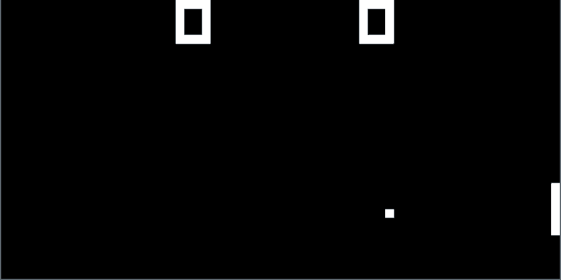

# chip8-c



### What is CHIP-8?
CHIP-8 is an interpreted programming language from the 1970s, designed to be less memory-intensive than languages like BASIC at the time — it needed only 4 kilobytes of RAM, the same as the Apollo guidance computer.
It has been used across video game consoles, home computers, and calculators.

### Project overview
A spec-compliant CHIP-8 emulator/VM written in C, with monochrome graphics via SDL3 and full keyboard input support. Built to deepen understanding of C and computer architecture. Audio support is planned for a future update.

## Feature set
- Full CHIP-8 instruction set
- 4 kB memory, 16 registers (V0–VF), 16-bit index register, stack, program counter
- Keyboard input (tested with `keypad_test.ch8`)
- Full `.ch8` ROM support

## Tools used
- Language: C
- Graphics: SDL3
- Build: Make + pkg-config

## Building

### Linux
Install SDL3:
```bash
# Fedora
sudo dnf install SDL3-devel

# Ubuntu/Debian
sudo apt install libsdl3-dev
```
Then build:
```bash
git clone https://github.com/sami-ennedoui/chip8-c.git
cd chip8-c
make
```

### Windows (MSYS2)
Install SDL3 via pacman:
```bash
pacman -S mingw-w64-ucrt-x86_64-SDL3
```
Then build the same way:
```bash
make
```

## Running
Pass the path to any `.ch8` ROM as an argument:
```bash
./chip8 src/Pong_1p.ch8
./chip8 src/IBM_Logo.ch8
./chip8 src/david_winters_space_invaders.ch8
```

## Keypad mapping
The original CHIP-8 keypad maps to your keyboard as follows:

| CHIP-8 | Keyboard |
|--------|----------|
| 1 2 3 C | 1 2 3 4 |
| 4 5 6 D | Q W E R |
| 7 8 9 E | A S D F |
| A 0 B F | Z X C V |
